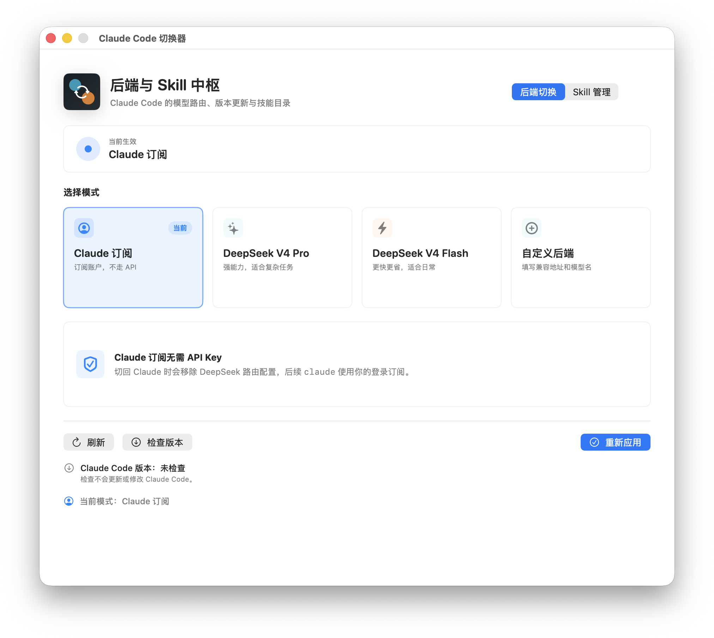
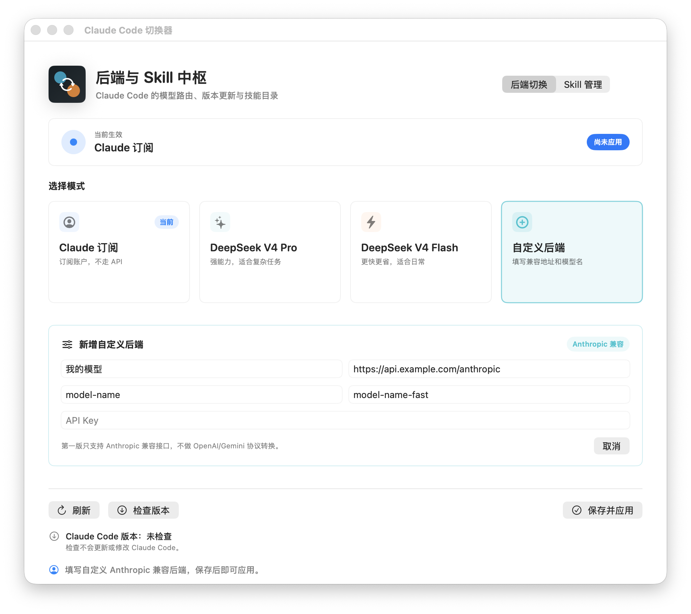

# Claude Code Switcher

一个 macOS 原生小工具，用来切换全局 Claude Code 后端。你不用手动改 `~/.claude/settings.json`，在界面里点一下，之后在任意文件夹运行 `claude` 都会走当前模式。

[English README](README.md)

## 截图





## 功能

- 切换后续 `claude` CLI 会话使用的后端：
  - Claude 订阅
  - DeepSeek V4 Pro
  - DeepSeek V4 Flash
  - 自定义 Anthropic 兼容后端
- API Key 保存到 macOS 钥匙串。
- 界面支持中文和英文切换，默认中文。
- 检查和更新 Claude Code，不弹终端。
- 管理 Claude Code Skill：
  - 扫描个人 Skill 和插件 Skill
  - 查看中文摘要和“如何使用”
  - 按分类筛选
  - 暂停和恢复单个 Skill
  - 显示文件、卸载、检查更新
- Skill 摘要模型可单独选择，也可以关闭自动摘要。

## 系统要求

- macOS 14 或更高版本
- 已安装 Claude Code，并且终端里可以运行 `claude`
- Claude 订阅，或一个 Anthropic 兼容 API 后端

这个项目目前只能用于 macOS，因为它依赖 SwiftUI/AppKit、macOS 钥匙串和 Claude Code 的本地配置路径。

## 安装

从 GitHub Releases 下载最新 zip，解压后把 `Claude Code Switcher.app` 拖到 `/Applications`。

如果 macOS 提示“无法验证开发者”，右键点击 App，选择“打开”，第一次确认后即可正常使用。后续如果做正式签名和 notarization，就可以减少这一步。

## 快速使用

1. 打开 `Claude Code Switcher`。
2. 选择后端。
3. 如果这个后端需要 API Key，填入后点击“保存密钥”。
4. 点击“应用模式”。
5. 打开任意文件夹，在终端运行 `claude`。

切换会影响新的 Claude Code CLI 会话。如果某个已经打开的 Claude Code 会话没有立刻变化，重启那个会话即可。

## 自定义 Anthropic 兼容后端

第一版只支持 Anthropic 兼容后端，不做 OpenAI、Gemini、Ollama 到 Anthropic 的协议转换。

添加方法：

1. 点击“自定义后端”。
2. 填一个容易识别的名称。
3. 填 Base URL，例如 `https://api.example.com/anthropic`。
4. 填主模型。
5. 填快速模型，可以和主模型相同。
6. 填 API Key。
7. 点击“保存并应用”。

应用后，工具会写入这些 Claude Code 路由变量：

- `ANTHROPIC_BASE_URL`
- `ANTHROPIC_AUTH_TOKEN`
- `ANTHROPIC_MODEL`
- `ANTHROPIC_DEFAULT_OPUS_MODEL`
- `ANTHROPIC_DEFAULT_SONNET_MODEL`
- `ANTHROPIC_DEFAULT_HAIKU_MODEL`
- `ANTHROPIC_SMALL_FAST_MODEL`
- `CLAUDE_CODE_SUBAGENT_MODEL`

切回 Claude 订阅时，会移除这些路由变量。

## Skill 摘要

Skill 摘要是可选的。

在 Skill 管理页，点击文本气泡图标选择摘要模型：

- 关闭自动摘要：不发起摘要网络请求。
- 任意已配置 API 后端：当你生成 Skill 摘要时，使用这个后端的钥匙串 API Key 和模型。

选择摘要模型不会自动重写现有摘要。需要生成时，在对应 Skill 的更多菜单里点击“生成摘要”或“重写摘要”。如果应用运行期间发现新增 Skill，且你已经配置了摘要模型，它可以自动为新增 Skill 生成摘要。

如果当前语言没有摘要，列表里会显示 Skill 原始描述。

## 隐私

这个工具是本地优先：

- API Key 只保存到 macOS 钥匙串。
- 自定义后端配置只保存名称、Base URL 和模型名，不保存 API Key。
- GitHub 仓库不会包含你的 Claude 配置、Skill 库、构建产物或本地截图。
- 只有你生成摘要时，才会把对应 Skill 文件内容发给你选择的摘要后端。

详见 [PRIVACY.md](PRIVACY.md)。

## 从源码构建

```bash
swift build --product "Claude Code Switcher"
swift run SettingsDocumentTestRunner
```

本地运行或安装：

```bash
./script/build_and_run.sh run
./script/build_and_run.sh install
```

生成发布 zip：

```bash
./script/package_release.sh
```

## 限制

- 仅支持 macOS。
- 自定义后端第一版只支持 Anthropic 兼容接口。
- 本项目与 Anthropic、Claude、DeepSeek 或其他模型提供方无官方关系。
- 插件级 Skill 的启停由 Claude Code 控制；本工具的单个 Skill 暂停/恢复是通过临时重命名该 Skill 的 `SKILL.md` 实现的，可随时恢复。

## 许可证

MIT
